# Projeto Le Ville
## Descrição Resumida do Projeto
 O jogo consiste em expandir sua cidade até possuir mais de 50%. Porém, o jogador perderá se:
 - Tiver 0 de população ao final de um turno
 - Tiver mais população do que espaço disponível
 - Não produzir ganhar comida ao final de algum turno
 
Para evitar tal, o jogador poderá escolher o que construir em cada espaço do mapa que pertencer a sí, aumentando ou diminuindo atributos de sua cidade. Além disso, eventos aleatórios ocorrem no início de cada turno, esses atrapalhando o jogador e impedindo que este vença facilmente.

## Equipe
- André Silva Telles - 165263

## Vídeos do Projeto
vídeo da primeira versão do projeto: 

[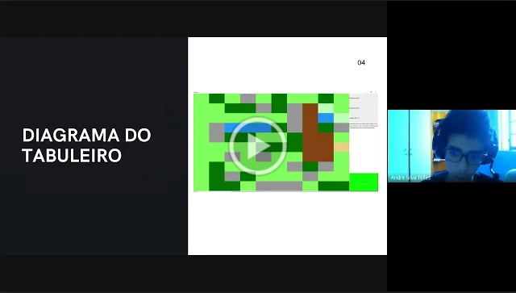][(./media/video_de_apresentacao-previa.mp4)]

vídeo da versão final do projeto
[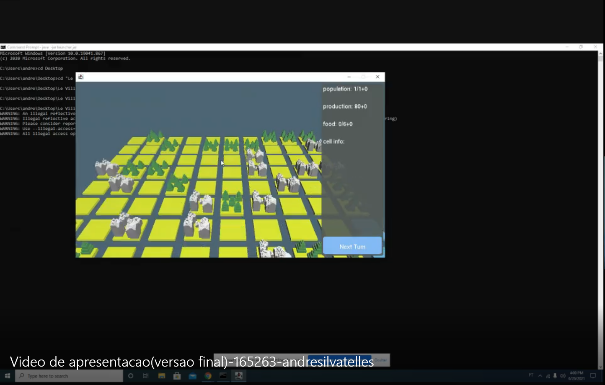](./media/video_de_apresentacao-final.mp4)

# Slides do Projeto
slides usados da primeira versão do projeto: 
[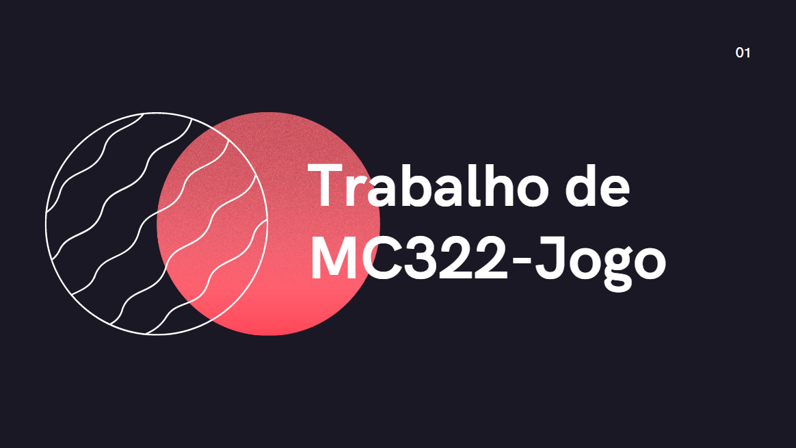](./media/apresentacao-previa.pdf)

# Documentação dos Componentes
# Diagramas

## Diagrama Geral de Componentes
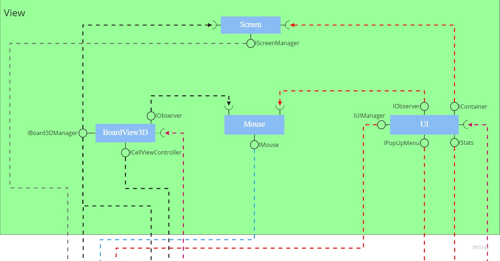
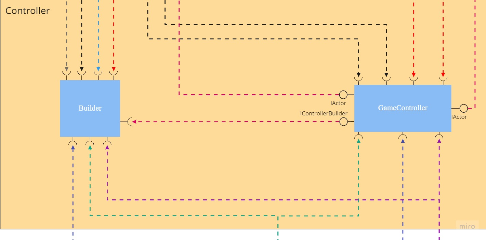
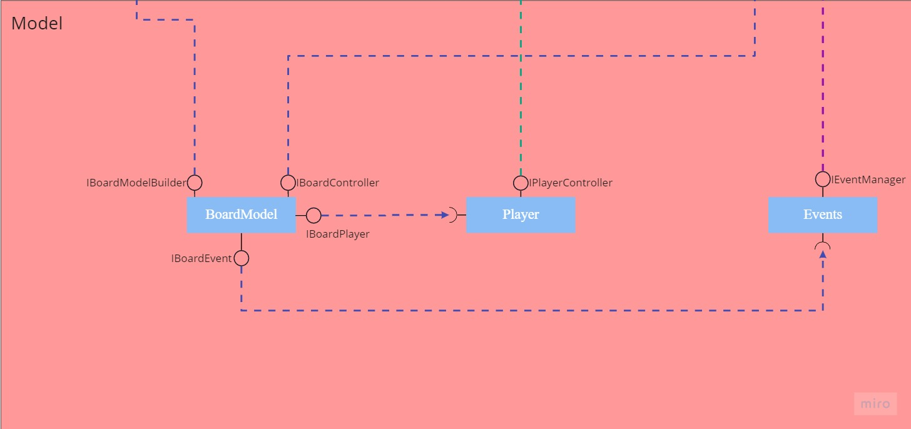

## Componente Builder
Este Componente pertence ao controller e é responsável por e conectar todos os outros componentes
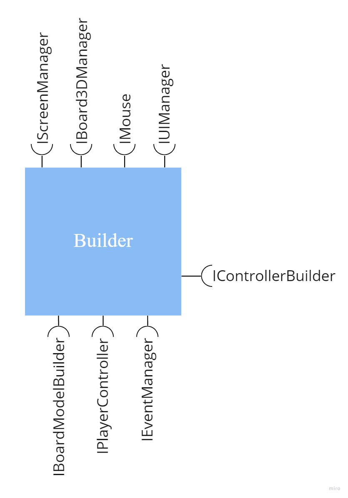

**Ficha Técnica**
Classe | autor | Interfaces
----- | ----- | -----
jogo.controller.Builder | André Silva Telles | IRBoardModelBuilder   IRScreenManager   IRUIManager   IRMouse   IRBoard3DManager   IREventManager  IRPlayerController  IRControllerBuilder 

### Interfaces
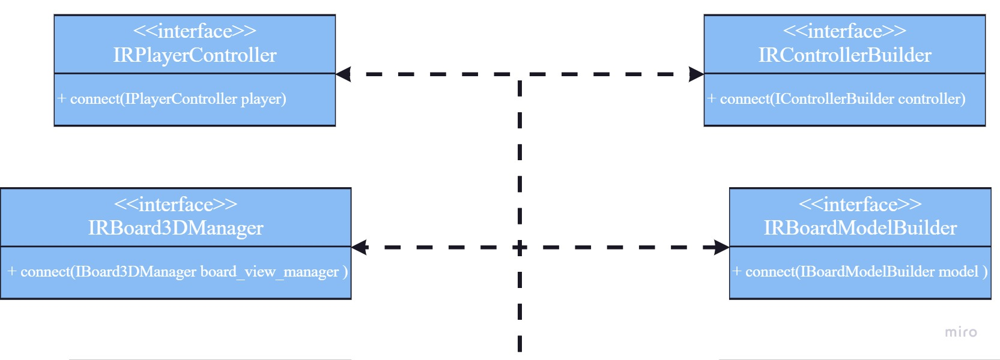
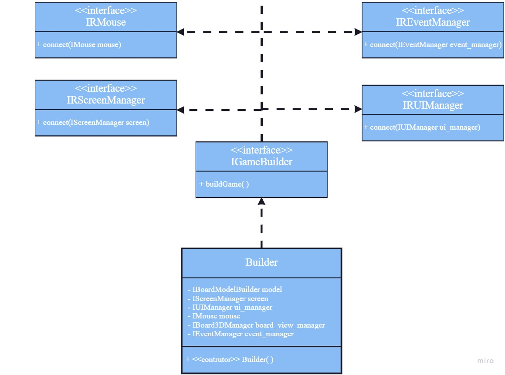

interface agregadora do componente em java:
~~~java 
public interface IGameBuilder
	extends IRBoardModelBuilder,IRScreenManager,
	IRUIManager,IRMouse,IRBoard3DManager,IREventManager,
	IRPlayerController,IRControllerBuilder
	{
	public void buildGame();	
}
~~~

O método build desta é o responsável por conectar todos os componentes do jogo

## Componente Screen 
Tem a função de apresentar o UI, parte em 2D, e o tabuleiro, parte em 3D para o usuário em um JFrame.
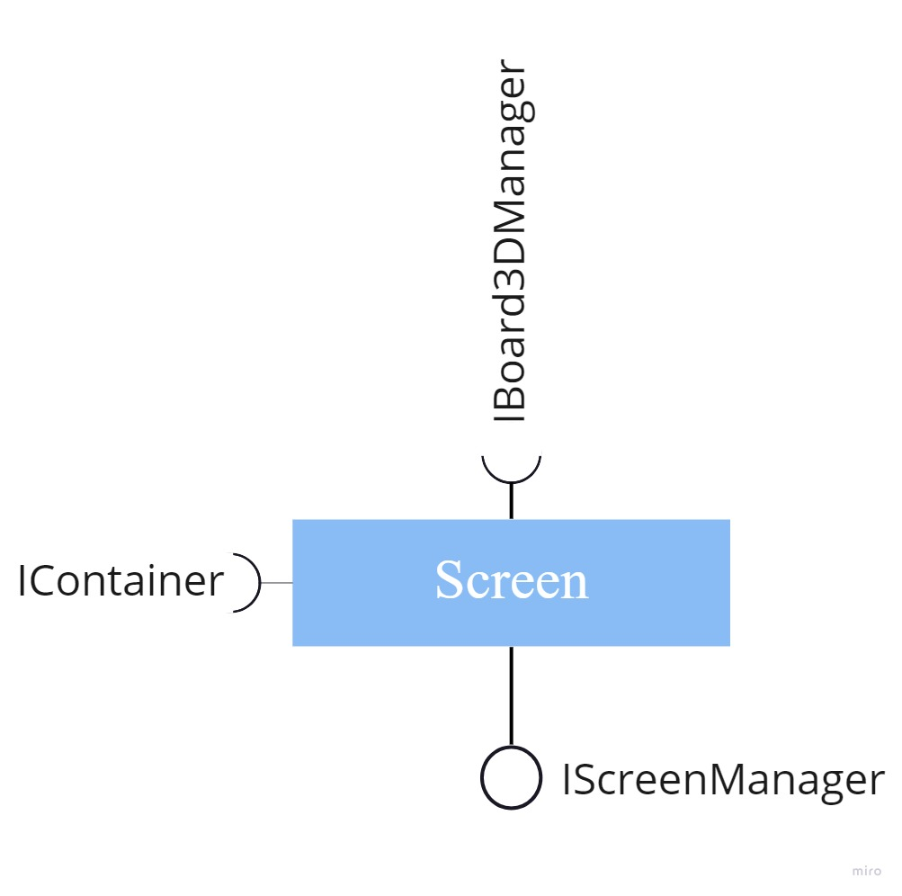

**Ficha Técnica**

Classe | autor | Interfaces
----- | ----- | -----
jogo.view.screen.ScreenManager | André Silva Telles | IScreenManager
jogo.view.screen.GameCanvas | André Silva Telles | GLEventListener
jogo.view.screen.GameFrame | André Silva Telles | JFrame

### Interfaces

interface responsável por organizar conexão do componente com componentes externos 

~~~java 
public interface IScreenManager {
	public void set2D(IContainer container);
	
	public void set3D(IBoard3DManager board);
	
	public void setMouse(IMouse mouse);
}
~~~

## Componente BoardView3D
Responsável por armazenar como cada célula é apresentada para o usuário. Controlando:
- Os modelos 3D disponíveis ao jogo
- Carregar os modelos 3D nos assets	
- O estado atual de cada célula
- como desenhar tais células na tela
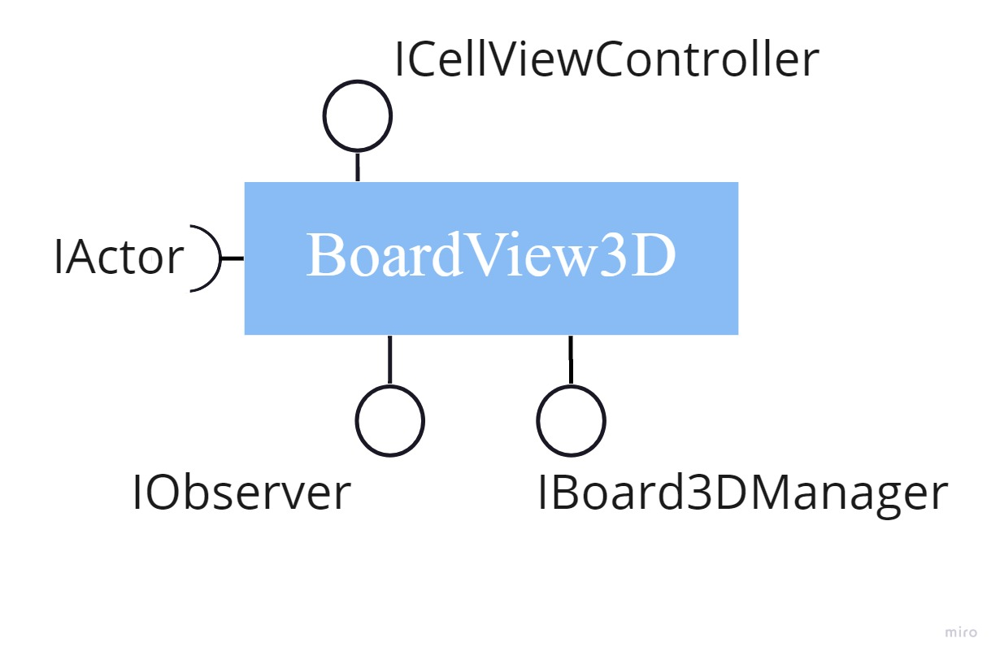

**Ficha Técnica**
Classe | autor | Interfaces
----- | ----- | -----
jogo.view.boardview3d.BoardViewManager | André Silva Telles | IBoard3DManager
jogo.view.boardview3d.CellView | André Silva Telles | ICellViewController
jogo.view.boardview3d.RayPicker | André Silva Telles | IMouseObserver
jogo.view.boardview3d.Game3DObjectManager | André Silva Telles | N/A
jogo.view.boardview3d.camera.GLCamera | André Silva Telles | N/A
jogo.view.boardview3d.camera.CameraDraggObserver | André Silva Telles | IMouseObserver
jogo.view.boardview3d.camera.CameraMotionObserver | André Silva Telles | IMouseObserver
jogo.view.boardview3d.customobject.Obj3D | André Silva Telles | N/A
jogo.view.boardview3d.customobject.Face3D | André Silva Telles | N/A
jogo.view.boardview3d.ArquivoModeloNaoEncontrado | André Silva Telles | N/A 
jogo.view.boardview3d.ComponenteInvalido | André Silva Telles | N/A 

### Interfaces
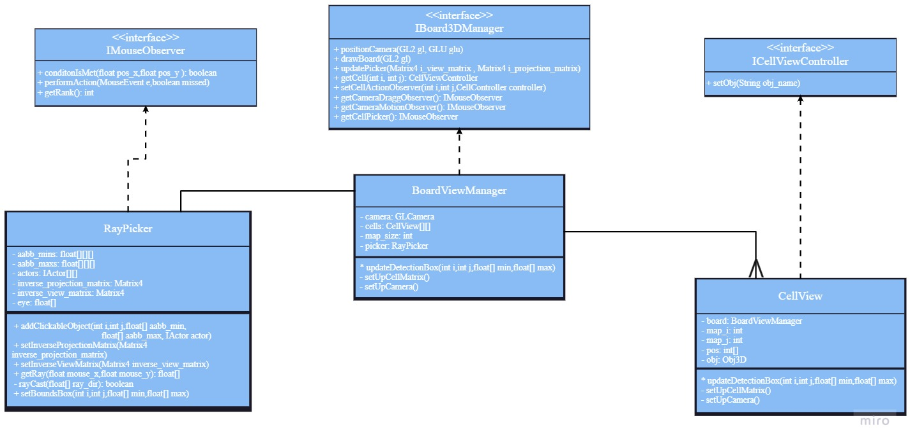

## Componente UI
Responsável por organizar os elementos 2D que serão apresentados na tela.
Para tal, foi empregado o design pattern _Composite_ . Este consiste em ter um elemento geral, o componente, e 2 sub elementos que herdam deste, o compostos e a folha. O composto pode possuir vários componentes como filho e a maioria de seus métodos é repassado para seus filhos. Já a folha fica encarregada de executar a operação implementada. Os compostos implementados foram:

- GLButton
- GLContainer
- GLPopUPMenu
- UI

e as folhas foram:
- GLLabel
- GLRectangle

O método principal deste é o _draw(GL2 gl)_. Este expressa como desenhar os elementos na tela
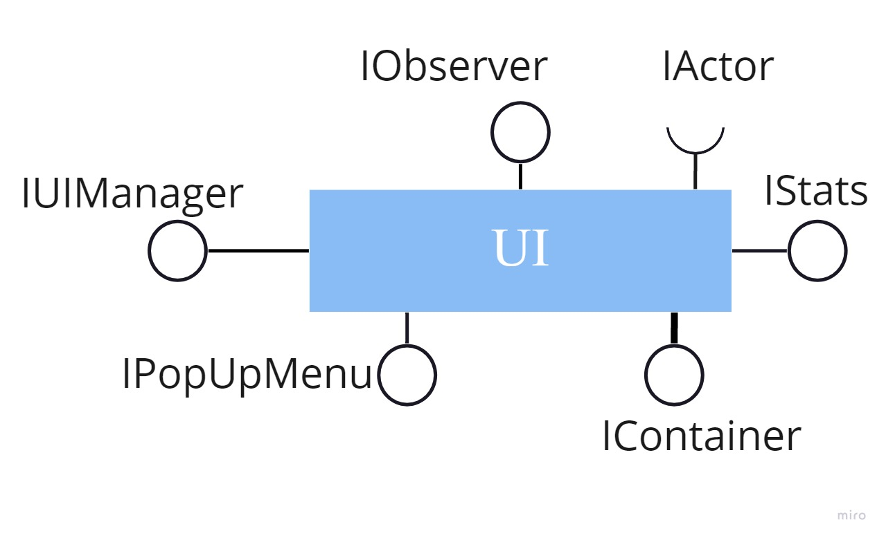

**Ficha Técnica**
Classe | autor | Interfaces
----- | ----- | -----
jogo.view.ui.UIManager | André Silva Telles | IUIManager
jogo.view.ui.UI | André Silva Telles | IStats
jogo.view.ui.GLElementLeaf | André Silva Telles | N/A
jogo.view.ui.GLElementComposite | André Silva Telles | N/A
jogo.view.ui.GLElementComponent | André Silva Telles | N/A
jogo.view.ui.GL2DObserver | André Silva Telles | N/A
jogo.view.ui.leaf.GLLabel | André Silva Telles | N/A
jogo.view.ui.leaf.GLRectangle | André Silva Telles | N/A
jogo.view.ui.composite.GLContainer | André Silva Telles | IContainer
jogo.view.ui.composite.GLPopUpMenu | André Silva Telles | IPopUpMenu
jogo.view.ui.composite.GLButton | André Silva Telles | N/A
jogo.view.ui.AtributoInvalido | André Silva Telles | N/A 
jogo.view.ui.PosicaoInvalida | André Silva Telles | N/A 
jogo.view.ui.IdInvalido | André Silva Telles | N/A 
jogo.view.ui.DimensoesInvalidas | André Silva Telles | N/A 
jogo.view.ui.CorInvalida | André Silva Telles | N/A 
jogo.view.ui.ComponenteInvalido | André Silva Telles | N/A 

### Interfaces
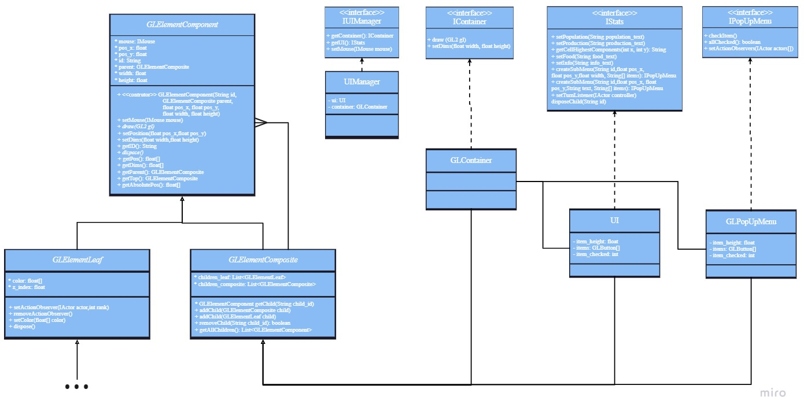

## Componente Mouse 
serve como uma ponte entre o componente screen, os componentes desenhados nele(UI e BoardView3D) e o controller. Checando se algum elemento foi ativado ou não(clicado, arrastado, movimentos, etc...) e informa sinaliza que o controller deve iniciar alguma ação
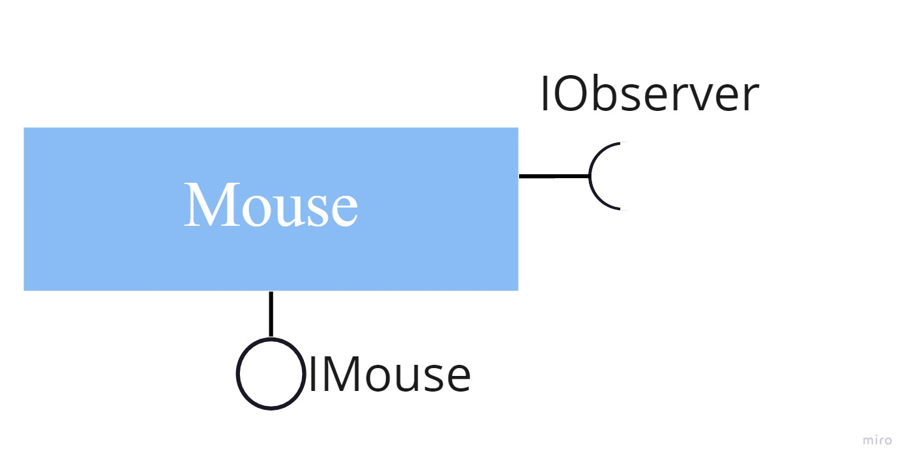
**Ficha Técnica**

item | detalhamento
----- | -----
Classe | jogo.controller.Builder
Autores | André Silva Telles
Interfaces |  IRBoardModelBuilder   IRScreenManager   IRUIManager   IRMouse   IRBoard3DManager   IREventManager

### Interfaces
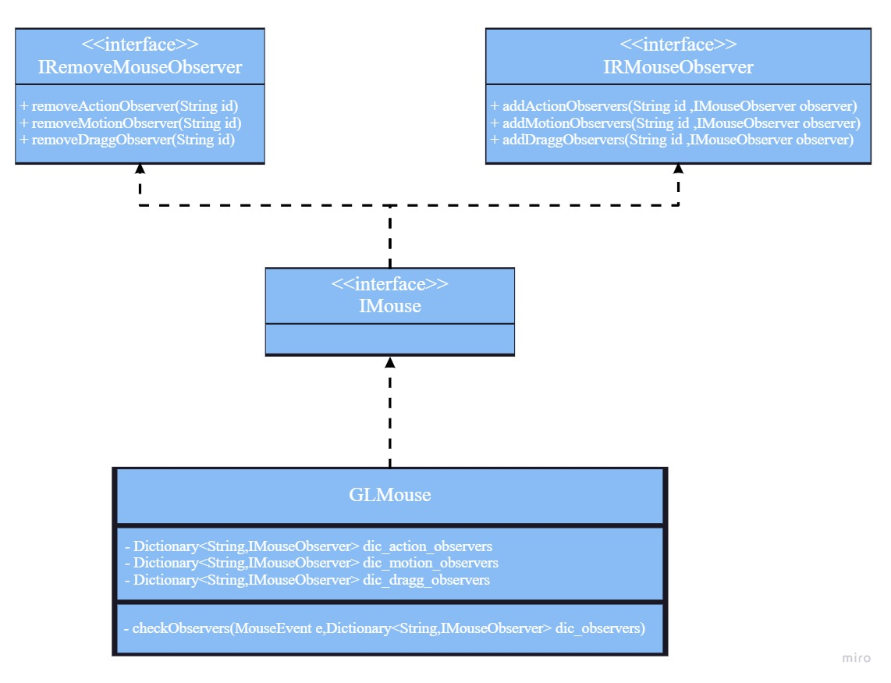

interface agregadora do componente em java:
~~~java 
public interface IMouse
	extends MouseListener,MouseMotionListener,
		IRMouseObserver,IRemoveMouseObserver{
	public void addActionObservers(String id ,IMouseObserver observer);
	
	public void removeActionObserver(String id);
	 
	public void addMotionObservers(String id ,IMouseObserver observer);
	
	public void removeMotionObserver(String id);
	
	public void addDraggObservers(String id ,IMouseObserver observer);
	
	public void removeDraggObserver(String id);
}
~~~

## Componente GameController 
responsável por executar as ações requisitadas pelo usuário através do mouse
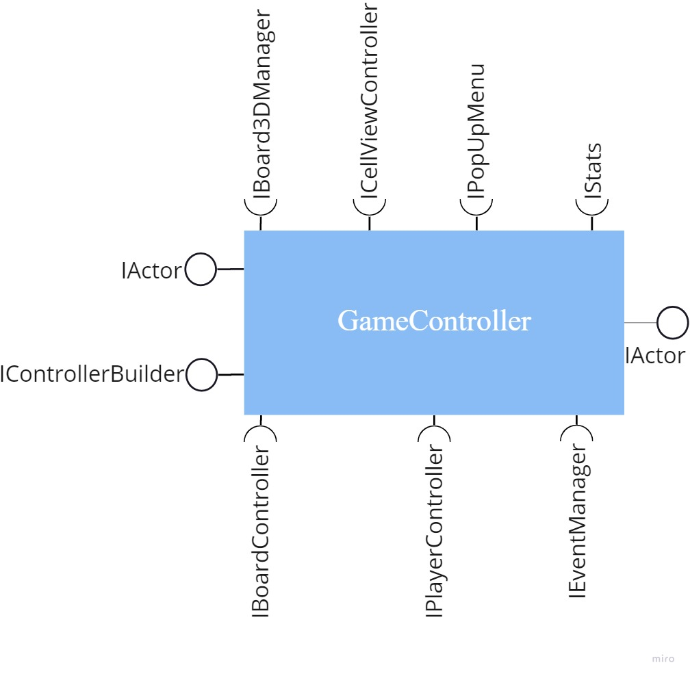

**Ficha Técnica**
Classe | autor | Interfaces
----- | ----- | -----
jogo.controller.gamecontroller.CellController | André Silva Telles | IActor
jogo.controller.gamecontroller.ConstructPopUpController | André Silva Telles | IActor
jogo.controller.gamecontroller.EventPopUpController | André Silva Telles | IActor
jogo.controller.gamecontroller.TurnController | André Silva Telles | IActor
jogo.controller.gamecontroller.ControllerManager | André Silva Telles | IControllerBuilder 

### Interfaces
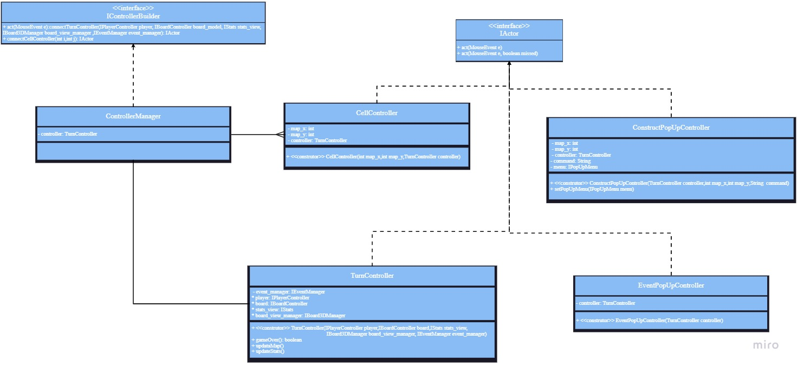

interface que permite que o controller seja conectado aos outros elementos
~~~java
public interface IControllerBuilder {
	public IActor connectTurnController(IPlayerController player,IBoardController board_model,
			IStats stats_view,IBoard3DManager board_view_manager,IEventManager event_manager);
	
	public IActor connectCellController(int i,int j);

}
~~~

## Componente BoardModel
responsável por guardar as informações do tabuleiro, por exemplo guardar:
- quais células foram tomadas pelo jogador
- as informações das células(posição, componentes na célula, atributos da célula, etc...)
- modificadores para o próximo turno
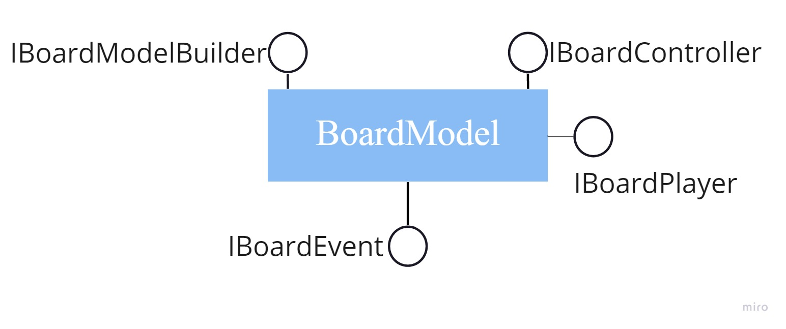

**Ficha Técnica**
Classe | autor | Interfaces
----- | ----- | -----
jogo.model.boardmodel.BoardManager | André Silva Telles | IBoardModelBuilder
jogo.model.boardmodel.CellModel | André Silva Telles | N/A
jogo.model.boardmodel.BoardModel | André Silva Telles | IBoardEvent  IBoardController  IBoardPlayer
jogo.model.boardmodel.mapgenerator.MapGenerator | André Silva Telles | N/A
jogo.model.boardmodel.mapgenerator.ImprovedNoise | André Silva Telles | N/A
jogo.model.boardmodel.components.Castle | André Silva Telles | N/A
jogo.model.boardmodel.components.City | André Silva Telles | N/A
jogo.model.boardmodel.components.Component | André Silva Telles | N/A
jogo.model.boardmodel.components.ConstructableComponent | André Silva Telles | N/A
jogo.model.boardmodel.components.Farm | André Silva Telles | N/A
jogo.model.boardmodel.components.Forest | André Silva Telles | N/A
jogo.model.boardmodel.components.Grass | André Silva Telles | N/A
jogo.model.boardmodel.components.LumberMill | André Silva Telles | N/A
jogo.model.boardmodel.components.Mountain | André Silva Telles | N/A
jogo.model.boardmodel.components.PreserveForest | André Silva Telles | N/A
jogo.model.boardmodel.components.Water | André Silva Telles | N/A

### Interfaces
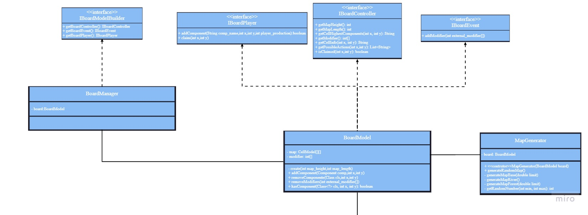
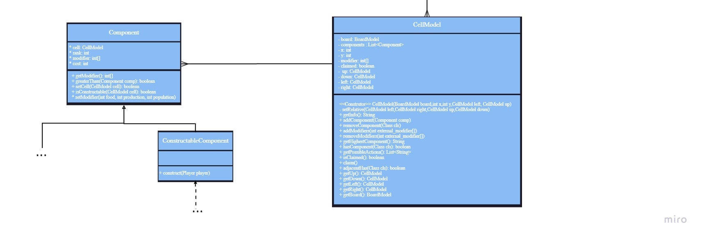

interface que comanda ligações do componente com outros componentes
~~~java
public interface IBoardModelBuilder {
	
	public IBoardController getBoardController();
	
	public IBoardEvent getBoardEvent();
	
	public IBoardPlayer getBoardPlayer();
}
~~~

## Componente Events 
responsável por ler e executar eventos aleatórios no tabuleiro
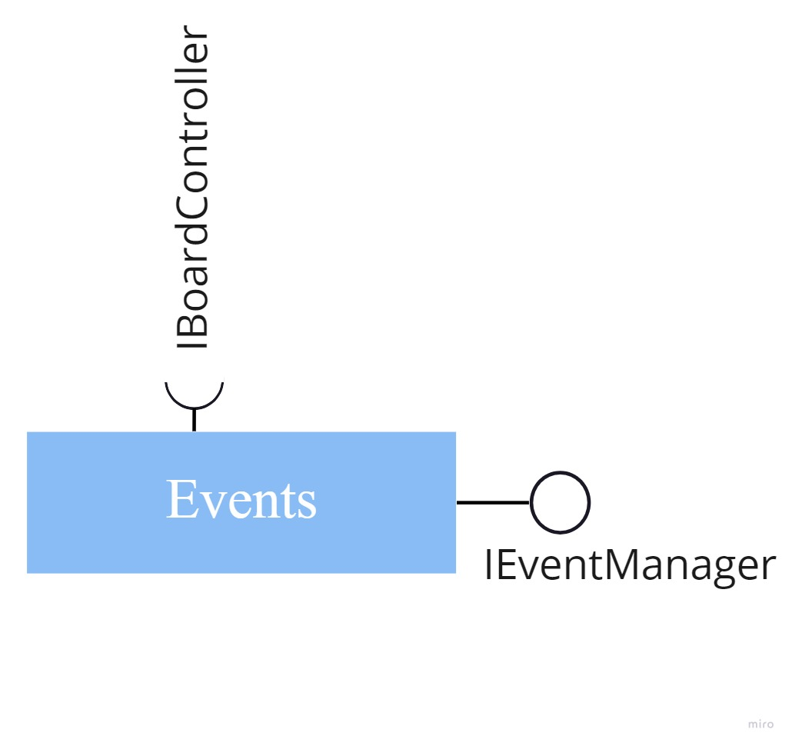

**Ficha Técnica**
Classe | autor | Interfaces
----- | ----- | -----
jogo.model.events.EventManager | André Silva Telles | IEventManager
jogo.model.events.Event | André Silva Telles | N/A
jogo.model.events.CityEvent | André Silva Telles | N/A
jogo.model.events.ArquivoEventosNaoEncontrado | André Silva Telles | N/A 

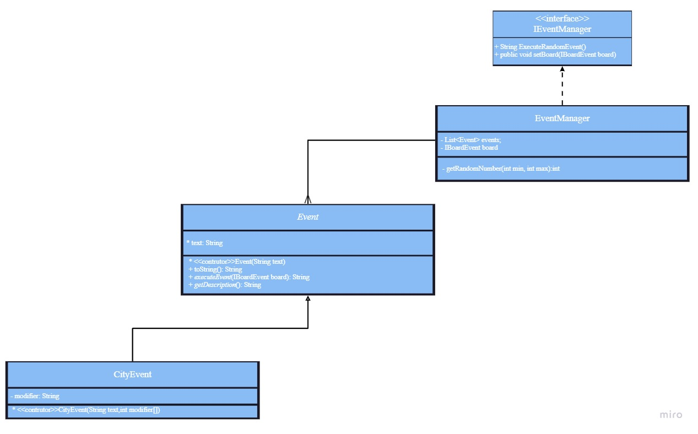

interface que permite o comando dos eventos
~~~java
public interface IEventManager {
	
	public String ExecuteRandomEvent();
	
	public void setBoard(IBoardEvent board);
	
}
~~~

## Componente Player 
responsável guardar todas as informações do jogador como:
- quantidade de população
- quantidade de "casas para a população"
- quantidade de produção
- quantidade de comida
- quantidade objetivo de comida
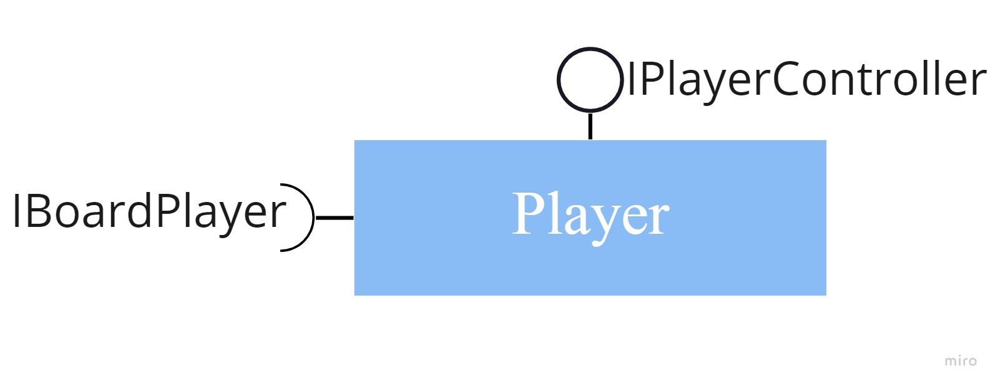

**Ficha Técnica**
Classe | autor | Interfaces
----- | ----- | -----
jogo.model.player.Player | André Silva Telles | IPlayerController

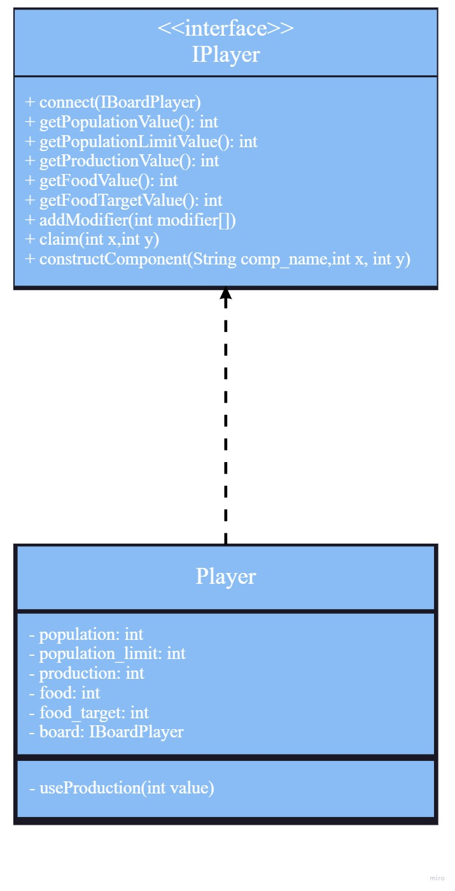

interface que permite o controlar os atributos do player
~~~java
public interface IPlayerController {
	
	public void connect(IBoardPlayer board);
	
	public int getPopulationValue();
	
	public int getPopulationLimitValue();
	
	public int getProductionValue();
	
	public int getFoodValue();
	
	public int getFoodTargetValue();
	
	public void addModifier(int modifier[]);
	
	public void claim(int x,int y);

	public  void constructComponent(String comp_name,int x, int y);
}
~~~

## Detalhamento das Interfaces

### Interface IRBoard3DManager

~~~java 
public interface IRBoard3DManager {
   public void connect(IBoard3DManager board_view_manager);
}
~~~
Método | Objetivo
-------| --------
connect | conectar o Componente Builder com o Componente BoardView3D 

### Interface IRBoardModelBuilder 

~~~java 
public interface IRBoardModelBuilder {
   public void connect(IBoardModelBuilder model);
}
~~~
Método | Objetivo
-------| --------
connect | conectar o Componente Builder com o Componente BoardModel 

### Interface IREventManager

~~~java 
public interface IREventManager {
   public void connect(IEventManager event_manager);
}
~~~
Método | Objetivo
-------| --------
connect | conectar o Componente Builder com o Componente Events

### Interface IRMouse

~~~java 
public interface IRMouse {
   public void connect(IMouse mouse);
}
~~~
Método | Objetivo
-------| --------
connect | conectar o Componente Builder com o Componente Mouse

### Interface IRScreenManager

~~~java 
public interface IRScreenManager {
   public void connect(IScreenManager screen);
}
~~~
Método | Objetivo
-------| --------
connect | conectar o Componente Builder com o Componente Screen

### Interface IRUIManager

~~~java 
public interface IRUIManager {
   public void connect(IUIManager ui_manager);
}
~~~
Método | Objetivo
-------| --------
connect | conectar o Componente Builder com o Componente UI

### Interface IRPlayerController

~~~java 
public interface IRPlayerController {
	public void connect(IPlayerController player);
}
~~~

| Método  | Objetivo                                              |
| ------- | ----------------------------------------------------- |
| connect | conectar o Componente Builder com o Componente Player |

### Interface IRPlayerController

~~~java 
public interface IRControllerBuilder {
	public void connect(IControllerBuilder controller_manager);
}
~~~

| Método  | Objetivo                                                  |
| ------- | --------------------------------------------------------- |
| connect | conectar o Componente Builder com o Componente Controller |

### Interface IGameBuilder

~~~java 
public interface IGameBuilder
	extends IRBoardModelBuilder,IRScreenManager,
	IRUIManager,IRMouse,IRBoard3DManager,IREventManager,
	IRPlayerController,IRControllerBuilder
	{
	public void buildGame();
	
}
~~~
Método | Objetivo
-------| --------
buildGame | conecta os Componentes do jogo uns com os outros

### Interface IControllerBuilder

~~~java 
public interface IControllerBuilder {
	public IActor connectTurnController(IPlayerController player,IBoardController board_model,
			IStats stats_view,IBoard3DManager board_view_manager,IEventManager event_manager);
	
	public IActor connectCellController(int i,int j);

}
~~~

| Método                | Objetivo                                        |
| --------------------- | ----------------------------------------------- |
| connectTurnController | cria o controller para o botão de próximo turno |
| connectCellController | cria um controller para uma célula do tabuleiro |

### 

### Interface IRMouseObserver

~~~java 
public interface IRMouseObserver {
	public void addActionObservers(String id ,IMouseObserver observer);
	
	public void addMotionObservers(String id ,IMouseObserver observer);
	
	public void addDraggObservers(String id ,IMouseObserver observer);
}
~~~
Método | Objetivo
-------| --------
addActionObservers | adiciona um observer com id ao mouse, notificando este sempre que o mouse clicar em algo
addMotionObservers | adiciona um observer com id ao mouse, notificando este sempre que o mouse se mover
addDraggObservers  | adiciona um observer com id ao mouse, notificando este sempre que o mouse arrastar algo

### Interface IRemoveMouseObserver

~~~java 
public interface IRemoveMouseObserver {
	public void removeActionObserver(String id);
	
	public void removeMotionObserver(String id);
	
	public void removeDraggObserver(String id);
}
~~~
Método | Objetivo
-------| --------
removeActionObserver | remove um observer de ações com id do mouse
removeMotionObserver | remove um observer de movimentos com id do mouse
removeDraggObserver  | remove um observer de arrastar com id do mouse

### Interface IMouseObserver

~~~java 
public interface IMouseObserver {
	public boolean conditonIsMet(float pos_x,float pos_y );
	
	public void performAction(MouseEvent e,boolean missed);

	public int getRank();
}
~~~
Método | Objetivo
-------| --------
conditonIsMet | checa se a condição para o observer realizar uma ação é cumprida, sem sim, retorna true, se não, retorna false
performAction | excuta a ação do observer
getRank | retorna o rank do observer para que seja possível comparar observers caso duas condições sejam cumpridas simultâneamente

### Interface IActor

~~~java 
public interface IActor {
	public void act(MouseEvent e);
	public void act(MouseEvent e,boolean missed);
}
~~~
Método | Objetivo
-------| --------
act | realiza uma ação baseada no MouseEvent e se a condição para realizar a ação foi cumprida ou não

### Interface IUIManager

~~~java 
public interface IUIManager {
	public IContainer getContainer();
	
	public IStats getUI();
	
	public void setMouse(IMouse mouse);
}
~~~
Método | Objetivo
-------| --------
getContainer | Retorna o elemento que contem o UI e, como consequencia, todos outros elementos 2D
getUI | retorna um elemento UI para que seja possível mudar textos da tela dinamicamente
setMouse | indica qual mouse os elementos 2D observaram para clicks na tela

### Interface IStats

~~~java 
public interface IStats {
	public void setPopulation(String population_text);
	
	public void setProduction(String production_text);
	
	public void setFood(String food_text);

	public void setInfo(String info_text);
	
	public IPopUpMenu createSubMenu(String id,float pos_x, float pos_y,float width, String[] items);
	
	public IPopUpMenu createSubMenu(String id,float pos_x, float pos_y,String text, String[] items);

	public void setTurnListener(IActor controller);
	
	public void disposeChild(String id);
}
~~~
Método | Objetivo
-------| --------
setPopulation | atualiza o texto referente a população na tela
setProduction | atualiza o texto referente a produção na tela
setFood | atualiza o texto referente a comida na tela
setInfo |atualiza o texto referente a informação na tela
createSubMenu | cria um menu pop up que será apresentado na tela(disponibilizando uma forma de adicionar observers aos botões de tal menu)
setTurnListener | indica o que o botão de proximo turn ira fazer quando clicado
disposeChild | deleta um elemento do UI

### Interface IPopUpMenu

~~~java 
public interface IPopUpMenu {
	public void checkItem();
	
	public boolean allChecked();
	
	public void setActionObservers(IActor actors[]);
	
}
~~~
Método | Objetivo
-------| --------
checkItem | marca que o observer de um item do menu pop up foi checou se o mouse cumpriu seu requisito para ser ativado
allChecked | informa se os observers de todos os items do menu pop up já realizaram seus testes para o ultimo evento do mouse
setActionObservers | indica o que cada botão do menu pop up deve fazer quando acionado

### Interface IContainer

~~~java 
public interface IContainer {
	public void draw(GL2 gl);
	public void setDims(float width,float height);
}

~~~
Método | Objetivo
-------| --------
draw | "desenha" todos elementos contidos no container na tela
setDims | informa o container quais as dimensões da tela que ele será desenhado(o JFrame/GLCanvas)

### Interface IScreenManager

~~~java 
public interface IScreenManager {
	public void set2D(IContainer container);
	
	public void set3D(IBoard3DManager board);
	
	public void setMouse(IMouse mouse);
}
~~~
Método | Objetivo
-------| --------
set2D | conecta os elementos 2D a tela
set3D | conecta os elementos 3D a tela
setMouse | conecta o mouse a tela

### Interface IMouse

~~~java 
public interface IMouse
	extends MouseListener,MouseMotionListener,
		IRMouseObserver,IRemoveMouseObserver{
	public void addActionObservers(String id ,IMouseObserver observer);
	
	public void removeActionObserver(String id);
	 
	public void addMotionObservers(String id ,IMouseObserver observer);
	
	public void removeMotionObserver(String id);
	
	public void addDraggObservers(String id ,IMouseObserver observer);
	
	public void removeDraggObserver(String id);
}
~~~
Método | Objetivo
-------| --------
addActionObservers | adiciona um observer com id ao mouse, notificando este sempre que o mouse clicar em algo
addMotionObservers | adiciona um observer com id ao mouse, notificando este sempre que o mouse se mover
addDraggObservers  | adiciona um observer com id ao mouse, notificando este sempre que o mouse arrastar algo
removeActionObserver | remove um observer de ações com id do mouse
removeMotionObserver | remove um observer de movimentos com id do mouse
removeDraggObserver  | remove um observer de arrastar com id do mouse

### Interface IBoard3DManager

~~~java 
public interface IBoard3DManager {
	public void positionCamera(GL2 gl, GLU glu);
	
	public void drawBoard(GL2 gl);
	
	public void updatePicker(Matrix4 i_view_matrix , Matrix4 i_projection_matrix);
	
	public ICellViewController getCell(int i, int j);
	
	public void setCellActionObserver(int i,int j,CellController controller);
	
	public IMouseObserver getCameraDraggObserver();
	
	public IMouseObserver getCameraMotionObserver();
	
	public IMouseObserver getCellPicker();
}
~~~
Método | Objetivo
-------| --------
positionCamera | posiciona a câmera do jogador para renderizar a cena do jogo 
drawBoard | desenha o tabuleiro no espaço tridimensional da tela que esta sendo apresentado ao jogador
updatePicker | passa as matrizes atuais do opengl, permitindo o que o picker se localize
getCell | retorna um objeto que representa o elemento visível de uma célula 
setCellActionObserver | permite que uma célula seja clicada pelo jogador, passando o que deve ocorrer quando esta for clicada 
getCameraDraggObserver | retorna o elemento que move a câmera 
getCameraMotionObserver | retorna o elemento que auxilia a câmera ser movida 
getCellPicker | retorna o elemento que seleciona as células tri-dimensionais apresentadas ao jogador 

### Interface ICellViewController

~~~java 
public interface ICellViewController {
	public void setObj(String obj_name);
}
~~~
Método | Objetivo
-------| --------
setObj | muda o modelo 3D que será apresentado ao jogador por esta celula

### Interface IEventManager

~~~java 
public interface IEventManager {
	
	public String ExecuteRandomEvent();
	
	public void setBoard(IBoardEvent board);
	
}
~~~
Método | Objetivo
-------| --------
ExecuteRandomEvent | executa um evento aleatório sobre o tabuleiro
setBoard | conecta o Gerente de eventos com o tabuleiro que este afetará

### Interface IBoardEvent

~~~java 
public interface IBoardEvent {
	public void addModifier(int external_modifier[]);
}
~~~
Método | Objetivo
-------| --------
addModifier | atualiza o vetor de modificadores do tabuleiro com modificadores externos(outro vetor)

### Interface IBoardController

~~~java 
public interface IBoardController {
	public int getMapLength();
	
	public int getMapHeight();
	
	public String getCellHighestComponents(int x,int y);
	
	public int[] getModifier();
	
	public String getCellInfo(int x, int y);
	
	public List<String> getPossibleActions(int x,int y);

	public boolean isClaimed(int x,int y);
}
~~~
Método | Objetivo
-------| --------
getMapLength | retorna a largura do tabuleiro
getMapHeight | retorna a altura do tabuleiro
getCellHighestComponents | retorna o nome do componente com rank mais alto na celula especificada
getModifier | retorna o vetor de modificadores do tabuleiro
getCellInfo | retorna uma string com informções relevantes ao jogador sobre a celula especificada
getPossibleActions | retorna que ações podem ser realizadas sobre a celula especificada
isClaimed | checa se a celula especificada pertence ao jogador

### Interface IBoardModelBuilder

~~~java 
public interface IBoardModelBuilder {
	
	public IBoardController getBoardController();
	
	public IBoardEvent getBoardEvent();
	
	public IBoardPlayer getBoardPlayer();
}
~~~
Método | Objetivo
-------| --------
getBoardPlayer | retorna o que representa o tabuleiro na forma de um IBoardPlayer para que este seja conectado a um objeto IPlayerController 
getBoardController | retorna o obeto que representa o tabuleiro na forma de um IBoardController para restringir o que pode ser feito com esse
getBoardEvent | retorna o obeto que representa o tabuleiro na forma de um IBoardEvent para restringir o que pode ser feito com esse

### Interface IPlayerController

~~~java 
public interface IPlayerController {
	public void connect(IBoardPlayer board);
    
	public int getPopulationValue();
	
	public int getPopulationLimitValue();
	
	public int getProductionValue();
	
	public int getFoodValue();
	
	public int getFoodTargetValue();
	
	public void addModifier(int modifier[]);
	
	public void claim(int x,int y);

	public  void constructComponent(String comp_name,int x, int y);
}
~~~
Método | Objetivo
-------| --------
 connect                 | indica ao objeto qual tabuleiro está sendo utilizado no jogo 
 getPopulationValue      | retorna quanto de população o jogador possui                 
 getPopulationLimitValue | retorna quantas "casas" o jogador possui                     
 getProductionValue      | retorna quanto de produção o jogador possui                  
 getFoodValue            | retorna quanto de comida o jogador possui                    
 getFoodTargetValue      | retorna qual a quantidade de comida o jogador deve atingir para ganhar mais população 
 addModifier             | adiciona um modificador aos atributos do jogador             
 claim                   | toma a celula especificada para o jogador                    
 constructComponent      | constrói um componente na célula especificada se o jogador possuir produção o bastante 

# Plano de Exceções
## Diagrama da hierarquia de exceções

## Descrição das classes de exceção
Classe | Descrição
----- | -----
ArquivoNaoEncontrado | Indica que o arquivo desejado não foi encontrado na pasta de assets 
ArquivoEventosNaoEncontrado | Indica que o arquivo de eventos aleatórios não foi encontrado na pasta de assets 
ArquivoModeloNaoEncontrado | Indica que o arquivo de um modelo 3D não foi encontrado na pasta de assets 
MouseInvalido | Indica que GLMouse não foi inicializado 
AtributoInvalido | Indica que algum dos valores passados na criação de um GLElementComponent é null ou esta fora do escopo do atributo(ex:  altura negativa,...)
ComponenteInvalido | Indica que a string passada não referencia um modelo 3d ao qual o jogo tem acesso 
